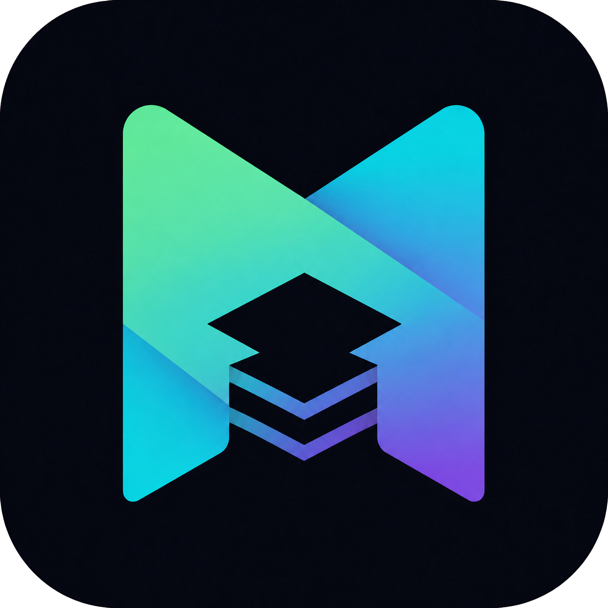

<p align="center">
  
</p>

# Nivora

**Независимый каталог Linux-приложений для Stapler.**

Nivora предлагает открытые рецепты упаковки десктопных приложений и
инструментов, которых может не быть в системном репозитории. Это не
официальный репозиторий Stapler и не официальные пакеты upstream-проектов.

<!-- package-count -->
**19 пакетов** · **6 категорий** · `amd64`, `arm64` и `all`

[](https://github.com/Cheviiot/Nivora/actions/workflows/quality.yml)

## Подключение

Требуется [Stapler](https://stplr.dev/docs/intro/) `v0.1.1` или новее.

```bash
sudo stplr repo add nivora https://github.com/Cheviiot/Nivora.git
sudo stplr refresh
```

Установка пакета:

```bash
sudo stplr install nivora/codex
```

Проверить описание до установки:

```bash
stplr info nivora/codex
```

## Каталог

Название ведёт на источник приложения. `all` означает, что сам пакет не
содержит архитектурно-зависимых бинарников.

### Интернет, сеть и VPN

| Приложение | Версия | Архитектуры | Установка |
|:--|:--:|:--:|:--|
| [Clash Verge Rev](https://github.com/clash-verge-rev/clash-verge-rev) | `2.5.2` | `amd64`, `arm64` | `stplr install nivora/clash-verge-rev` |
| [Happ](https://happ.su/) | `3.3.6` | `amd64`, `arm64` | `stplr install nivora/happ` |
| [NetBird](https://netbird.io/) | `0.75.0` | `amd64`, `arm64` | `stplr install nivora/netbird` |
| [Tailscale](https://tailscale.com/) | `1.98.9` | `amd64`, `arm64` | `stplr install nivora/tailscale` |
| [Яндекс Браузер](https://browser.yandex.ru/) | `26.4.1.1110` | `amd64` | `stplr install nivora/yandex-browser-stable` |

### Удалённый доступ

| Приложение | Версия | Архитектуры | Установка |
|:--|:--:|:--:|:--|
| [Parsec](https://parsec.app/downloads) | `150-104a` | `amd64` | `stplr install nivora/parsec` |

### AI и разработка

| Приложение | Версия | Архитектуры | Установка |
|:--|:--:|:--:|:--|
| [Chatbox](https://chatboxai.app/ru) | `1.20.3` | `amd64`, `arm64` | `stplr install nivora/chatbox` |
| [Claude](https://code.claude.com/docs/en/desktop-quickstart) | `1.24012.0` | `amd64`, `arm64` | `stplr install nivora/claude-desktop` |
| [Codex](docs/packages/codex.md) | `26.721.31836` | `amd64` | `stplr install nivora/codex` |
| [GitHub Desktop](docs/packages/github-desktop.md) | `3.6.3` | `amd64`, `arm64` | `stplr install nivora/github-desktop` |
| [OpenCode](https://opencode.ai/) | `1.18.4` | `amd64`, `arm64` | `stplr install nivora/opencode` |

### Рабочий стол

| Приложение | Версия | Архитектуры | Установка |
|:--|:--:|:--:|:--|
| [Adwyra](https://github.com/Cheviiot/Adwyra) | `0.6.1` | `all` | `stplr install nivora/adwyra` |
| [AniDesk](https://github.com/theDesConnet/AniDesk) | `0.0.1-beta.7` | `amd64` | `stplr install nivora/anidesk` |

### Игры

| Приложение | Версия | Архитектуры | Установка |
|:--|:--:|:--:|:--|
| [PineconeMC](https://pineconemc.com/) | `11.0.3` | `amd64`, `arm64` | `stplr install nivora/pineconemc` |
| [Vual](https://github.com/Cheviiot/Vual) | `0.3.1` | `all` | `stplr install nivora/vual` |

### Системные инструменты

| Приложение | Версия | Архитектуры | Установка |
|:--|:--:|:--:|:--|
| [balenaEtcher](https://etcher.balena.io/) | `2.1.6` | `amd64` | `stplr install nivora/balena-etcher` |
| [Fisher](https://github.com/jorgebucaran/fisher) | `4.4.8` | `all` | `stplr install nivora/fisher` |
| [Nivora Stapler Helper](docs/packages/nivora-stplr.md) | `0.3.0` | `all` | `stplr install nivora/nivora-stplr` |
| [Ventoy](docs/packages/ventoy.md) | `1.1.17` | `amd64`, `arm64` | `stplr install nivora/ventoy` |

## Обновление

```bash
sudo stplr refresh
sudo stplr upgrade
```

Рецепты сохраняют пути пользовательских конфигураций. Обычное обновление и
удаление пакета не должно сбрасывать настройки или выполнять logout.

## Безопасность и доверие

- Каждый `Staplerfile` доступен для проверки.
- Файлы загружаются из указанных upstream-источников.
- SHA-256 проверяет целостность загрузки, но не делает upstream автоматически безопасным.
- Условия проприетарных приложений определяются их разработчиками.
- Наличие CI не обещает абсолютную безопасность или совместимость с любой системой.

Подробнее: [модель доверия](docs/security-model.md) и [политика безопасности](SECURITY.md).

## Для сопровождающих

```bash
tools/run_checks.sh
tools/package_updates.sh check-all
tools/clean_build.sh --all
tools/verify_artifacts.sh --all
tools/test_package_lifecycle.sh
```

Правила изменений описаны в [CONTRIBUTING.md](CONTRIBUTING.md), а порядок сопровождения — в
[docs/maintenance.md](docs/maintenance.md).
