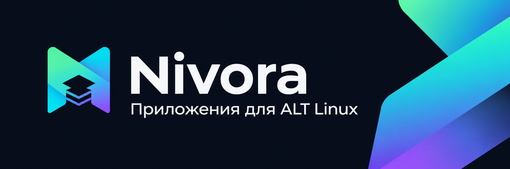

<p align="center">
  
</p>

<p align="center">
  <a href="https://stplr.dev/docs/intro/"></a>
  
  
  <a href="https://github.com/Cheviiot/Nivora/actions/workflows/quality.yml"></a>
  <a href="LICENSE"></a>
</p>

<p align="center">
  Готовые рецепты десктопных приложений и системных инструментов,<br>
  которых может не быть в стандартном репозитории вашего дистрибутива.
</p>

<p align="center">
  <a href="#-быстрый-старт">Быстрый старт</a> ·
  <a href="#-каталог">Каталог</a> ·
  <a href="#-совместимость">Совместимость</a> ·
  <a href="#-безопасность-и-доверие">Безопасность</a> ·
  <a href="CONTRIBUTING.md">Участие в проекте</a>
</p>

<!-- package-count -->
<p align="center"><strong>16 пакетов</strong> · <strong>6 категорий</strong> · <code>amd64</code>, <code>arm64</code> и <code>all</code></p>

> [!NOTE]
> Nivora — независимый community-репозиторий. Он не является официальным
> репозиторием Stapler или официальным каналом распространения приложений.

## ✦ Почему Nivora

| Прозрачные рецепты | Проверяемые загрузки | Честная совместимость |
|:--|:--|:--|
| Каждый `Staplerfile` открыт для аудита: источники, зависимости, hooks и состав пакета видны до установки. | Загружаемые файлы закреплены SHA-256; изменяемые upstream-источники дополнительно контролируются fingerprint. | Матрица различает доказанную, частичную, экспериментальную и неподдерживаемую конфигурации без завышенных обещаний. |

## ⚡ Быстрый старт

Нужен [Stapler](https://stplr.dev/docs/intro/) `v0.1.1` или новее.

```bash
# 1. Подключить Nivora
sudo stplr repo add nivora https://github.com/Cheviiot/Nivora.git

# 2. Загрузить индекс
sudo stplr refresh

# 3. Изучить и установить пакет
stplr info nivora/chatgpt
sudo stplr install nivora/chatgpt
```

Для коротких команд и интерактивного меню можно установить
[Nivora CLI](nivora-cli/README.md):

```bash
sudo stplr install nivora/nivora-cli
nv
```

Индекс обновляется только явной командой `sudo stplr refresh`. Nivora не
полагается на неработающий в Stapler v0.1.1 параметр `autoPull`.

## ◈ Каталог

Нажмите на название приложения, чтобы открыть подробности. `all` означает,
что пакет не содержит архитектурно-зависимых бинарников.

<!-- catalog:start -->
### Интернет, сеть и VPN

<table>
  <tr>
    <td width="50%" valign="top">
      <!-- package-card:happ -->
      &nbsp; <strong><a href="https://happ.su/">Happ</a></strong><br>&nbsp; <sub>GUI-клиент xray-core и TUN/VPN</sub><br><br>
      <code>4.1.3</code> · <code>amd64</code> <code>arm64</code><br>
      <code>stplr install nivora/happ</code>
    </td>
    <td width="50%" valign="top">
      <!-- package-card:tailscale -->
      &nbsp; <strong><a href="https://tailscale.com/">Tailscale</a></strong><br>&nbsp; <sub>Mesh VPN на базе WireGuard</sub><br><br>
      <code>1.102.3</code> · <code>amd64</code> <code>arm64</code><br>
      <code>stplr install nivora/tailscale</code>
    </td>
  </tr>
  <tr>
    <td width="50%" valign="top">
      <!-- package-card:telegram -->
      &nbsp; <strong><a href="https://desktop.telegram.org/">Telegram</a></strong><br>&nbsp; <sub>Официальный десктопный мессенджер</sub><br><br>
      <code>7.1.5</code> · <code>amd64</code><br>
      <code>stplr install nivora/telegram</code>
    </td>
    <td width="50%" valign="top">
      <!-- package-card:vesktop -->
      &nbsp; <strong><a href="vesktop/README.md">Vesktop</a></strong><br>&nbsp; <sub>Discord-клиент с интеграцией Vencord</sub><br><br>
      <code>1.6.7</code> · <code>amd64</code> <code>arm64</code><br>
      <code>stplr install nivora/vesktop</code>
    </td>
  </tr>
  <tr>
    <td width="50%" valign="top">
      <!-- package-card:yandex-music -->
      &nbsp; <strong><a href="yandex-music/README.md">Yandex Music</a></strong><br>&nbsp; <sub>Официальный клиент музыкального сервиса</sub><br><br>
      <code>5.118.1</code> · <code>amd64</code><br>
      <code>stplr install nivora/yandex-music</code>
    </td>
    <td width="50%" valign="middle"><em>Ещё больше приложений появится после полной проверки рецептов.</em></td>
  </tr>
</table>

### Удалённый доступ

<table>
  <tr>
    <td width="50%" valign="top">
      <!-- package-card:parsec -->
      &nbsp; <strong><a href="https://parsec.app/downloads">Parsec</a></strong><br>&nbsp; <sub>Удалённый рабочий стол с низкой задержкой</sub><br><br>
      <code>150-104a</code> · <code>amd64</code><br>
      <code>stplr install nivora/parsec</code>
    </td>
    <td width="50%" valign="middle"><em>Подходит для удалённой работы и игрового стриминга.</em></td>
  </tr>
</table>

### AI и разработка

<table>
  <tr>
    <td width="50%" valign="top">
      <!-- package-card:chatgpt -->
      &nbsp; <strong><a href="chatgpt/README.md">ChatGPT</a></strong><br>&nbsp; <sub>Десктопный клиент OpenAI</sub><br><br>
      <code>26.901.41600</code> · <code>amd64</code> <code>arm64</code><br>
      <code>stplr install nivora/chatgpt</code>
    </td>
    <td width="50%" valign="top">
      <!-- package-card:claude -->
      &nbsp; <strong><a href="claude/README.md">Claude</a></strong><br>&nbsp; <sub>Десктопный клиент Anthropic</sub><br><br>
      <code>1.40609.1</code> · <code>amd64</code> <code>arm64</code><br>
      <code>stplr install nivora/claude</code>
    </td>
  </tr>
  <tr>
    <td width="50%" valign="top">
      <!-- package-card:github-desktop -->
      &nbsp; <strong><a href="github-desktop/README.md">GitHub Desktop</a></strong><br>&nbsp; <sub>Официальный код GitHub Desktop, собранный для Linux</sub><br><br>
      <code>3.6.5</code> · <code>amd64</code> <code>arm64</code><br>
      <code>stplr install nivora/github-desktop</code>
    </td>
    <td width="50%" valign="top">
      <!-- package-card:vintner -->
      &nbsp; <strong><a href="https://github.com/Cheviiot/vintner">Vintner</a></strong><br>&nbsp; <sub>Настоящий MSVC на Linux через Wine</sub><br><br>
      <code>0.5.0</code> · <code>amd64</code> <code>arm64</code><br>
      <code>stplr install nivora/vintner</code>
    </td>
  </tr>
</table>

### Рабочий стол

<table>
  <tr>
    <td width="50%" valign="top">
      <!-- package-card:anidesk -->
      &nbsp; <strong><a href="https://github.com/theDesConnet/AniDesk">AniDesk</a></strong><br>&nbsp; <sub>Неофициальный desktop-клиент Anixart</sub><br><br>
      <code>0.0.1-beta.7</code> · <code>amd64</code><br>
      <code>stplr install nivora/anidesk</code>
    </td>
    <td width="50%" valign="middle"><em>Приложения, которые органично дополняют Linux-десктоп.</em></td>
  </tr>
</table>

### Игры

<table>
  <tr>
    <td width="50%" valign="top">
      <!-- package-card:pineconemc -->
      &nbsp; <strong><a href="https://pineconemc.com/">PineconeMC</a></strong><br>&nbsp; <sub>Minecraft launcher с Ely.by и offline-аккаунтами</sub><br><br>
      <code>11.0.3</code> · <code>amd64</code> <code>arm64</code><br>
      <code>stplr install nivora/pineconemc</code>
    </td>
    <td width="50%" valign="middle"><em>Игровые инструменты с воспроизводимой пакетной установкой.</em></td>
  </tr>
</table>

### Системные инструменты

<table>
  <tr>
    <td width="50%" valign="top">
      <!-- package-card:balena-etcher -->
      &nbsp; <strong><a href="https://etcher.balena.io/">balenaEtcher</a></strong><br>&nbsp; <sub>Запись образов на SD-карты и USB</sub><br><br>
      <code>2.1.6</code> · <code>amd64</code><br>
      <code>stplr install nivora/balena-etcher</code>
    </td>
    <td width="50%" valign="top">
      <!-- package-card:distroshelf -->
      &nbsp; <strong><a href="distroshelf/README.md">DistroShelf</a></strong><br>&nbsp; <sub>Графическое управление Distrobox-контейнерами</sub><br><br>
      <code>1.5.2</code> · <code>amd64</code><br>
      <code>stplr install nivora/distroshelf</code>
    </td>
  </tr>
  <tr>
    <td width="50%" valign="top">
      <!-- package-card:nivora-cli -->
      &nbsp; <strong><a href="nivora-cli/README.md">Nivora CLI</a></strong><br>&nbsp; <sub>Компактная оболочка и меню для Stapler</sub><br><br>
      <code>1.1.0</code> · <code>all</code><br>
      <code>stplr install nivora/nivora-cli</code>
    </td>
    <td width="50%" valign="top">
      <!-- package-card:ventoy -->
      &nbsp; <strong><a href="ventoy/README.md">Ventoy</a></strong><br>&nbsp; <sub>Мультизагрузочные USB-накопители</sub><br><br>
      <code>1.1.17</code> · <code>amd64</code> <code>arm64</code><br>
      <code>stplr install nivora/ventoy</code>
    </td>
  </tr>
</table>
<!-- catalog:end -->

## ◎ Совместимость

Nivora тестирует релизный Stapler `v0.1.1` как обязательный контракт, а
закреплённый commit `main` — как advisory canary для раннего обнаружения
несовместимости.

| Уровень | Что означает |
|:--|:--|
| 🟢 `verified` | Нативные сборка, metadata, установка, безопасный smoke и удаление являются блокирующими проверками. |
| 🔵 `partial` | Поддержка объявлена с явными ограничениями, но полный target lifecycle пока не блокирует изменения. |
| 🟣 `experimental` | Best-effort конфигурация без доказанной поддержки пользовательского runtime. |
| ⚫ `unsupported` | Цель исключается до сборки. |

Сейчас `verified` присвоен только `nivora-cli` на Ubuntu 24.04 для нативных
`amd64` и `arm64`. Все 16 пакетов блокирующе собираются в ALT Sisyphus на
`x86_64`, но это не выдаётся за полный runtime-тест остальных систем.

Точные цели и ограничения каждого пакета находятся в
[машиночитаемой матрице](.github/support-matrix.toml).

## ↻ Обновление

```bash
sudo stplr refresh
sudo stplr upgrade
```

Рецепты сохраняют пользовательские конфигурации. Обычное обновление или
удаление пакета не должно сбрасывать настройки либо принудительно завершать
пользовательскую сессию.

## ◉ Безопасность и доверие

- Исходники рецептов и package hooks доступны для проверки до установки.
- SHA-256 подтверждает целостность выбранной загрузки, но сам по себе не делает upstream доверенным.
- Проприетарные приложения остаются под лицензиями и условиями их разработчиков.
- Проприетарные payload не публикуются в постоянных кэшах Nivora.
- Успешный CI не является обещанием абсолютной безопасности или совместимости с любой системой.

Подробнее: [модель доверия](.github/docs/security-model.md),
[политика безопасности](SECURITY.md) и [история изменений](CHANGELOG.md).

## Код и участие

Хотите добавить пакет или улучшить существующий рецепт — начните с
[руководства контрибьютора](CONTRIBUTING.md). Процесс обновления, локальные
проверки и правила сопровождения описаны в
[maintenance guide](.github/docs/maintenance.md).

<details>
<summary><strong>Команды сопровождающего</strong></summary>

```bash
.github/tools/run_checks.sh
.github/tools/package_updates.sh check-all
.github/tools/clean_build.sh --all
.github/tools/verify_artifacts.sh --all
.github/tools/test_package_lifecycle.sh
```

</details>

---

<p align="center">
  <br>
  <strong>Nivora</strong> · Linux-пакеты без магии за кулисами<br>
  <sub>MIT © 2026 Cheviiot</sub>
</p>
