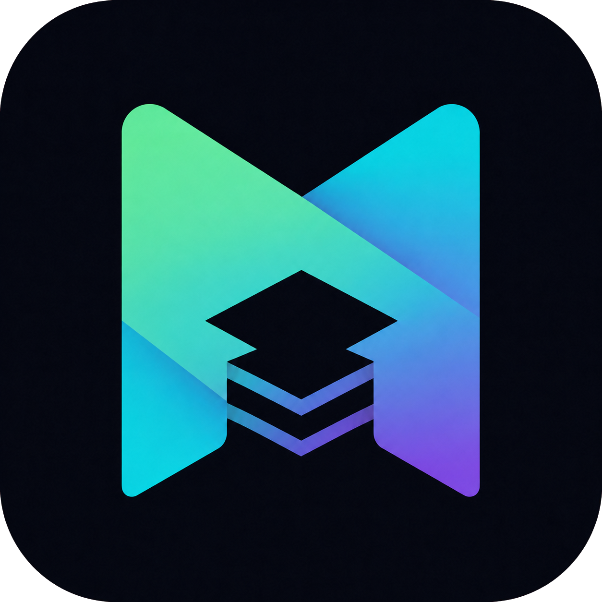
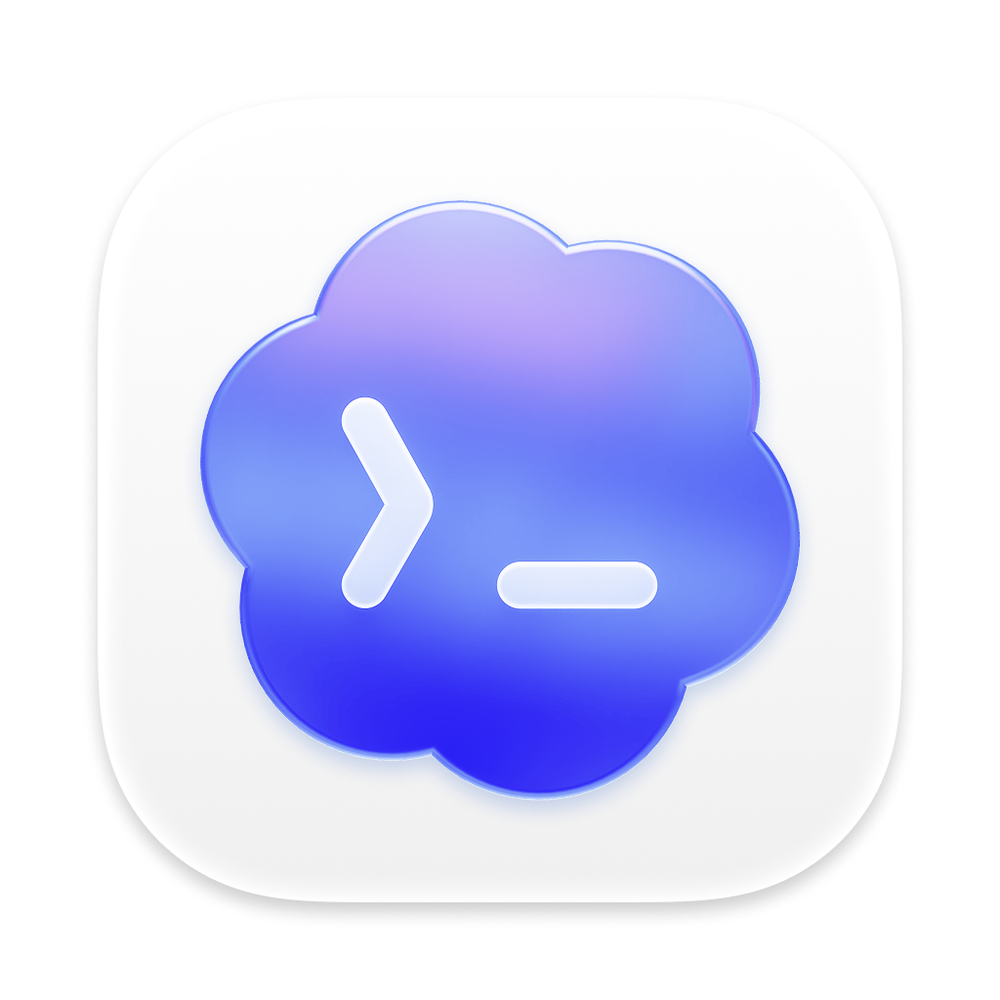

<p align="center">
  
</p>

<h1 align="center">Nivora</h1>

<p align="center">
  <strong>Независимый каталог Linux-приложений для Stapler</strong>
</p>

<p align="center">
  <a href="https://stplr.dev/docs/intro/"></a>
  
  <a href="https://github.com/Cheviiot/Nivora/actions/workflows/quality.yml"></a>
</p>

<p align="center">
  Открытые рецепты упаковки десктопных приложений и инструментов, которых
  может не быть в системном репозитории. Это не официальный репозиторий
  Stapler и не официальные пакеты upstream-проектов.
</p>

<p align="center">
  <a href="CHANGELOG.md">Changelog</a> •
  <a href="CONTRIBUTING.md">Контрибьюторам</a> •
  <a href="SECURITY.md">Безопасность</a> •
  <a href="LICENSE">Лицензия</a>
</p>

<!-- package-count -->
**22 пакета** · **6 категорий** · `amd64`, `arm64` и `all`

## Подключение

Требуется [Stapler](https://stplr.dev/docs/intro/) `v0.1.1` или новее.

```bash
sudo stplr repo add nivora https://github.com/Cheviiot/Nivora.git
sudo stplr refresh
```

Установка пакета:

```bash
sudo stplr install nivora/codex
```

Проверить описание до установки:

```bash
stplr info nivora/codex
```

## Каталог

Название ведёт на источник приложения. `all` означает, что сам пакет не
содержит архитектурно-зависимых бинарников.

### Интернет, сеть и VPN

| | Приложение | Версия | Архитектуры | Установка |
|:---:|---|:--:|:--:|---|
|  | [Happ](https://happ.su/) | `3.3.6` | `amd64`, `arm64` | `stplr install nivora/happ` |
|  | [Tailscale](https://tailscale.com/) | `1.102.2` | `amd64`, `arm64` | `stplr install nivora/tailscale` |
|  | [Telegram](https://desktop.telegram.org/) | `7.0.9` | `amd64` | `stplr install nivora/telegram` |
|  | [Vesktop](vesktop/README.md) | `1.6.7` | `amd64`, `arm64` | `stplr install nivora/vesktop` |
|  | [Яндекс Браузер](https://browser.yandex.ru/) | `26.6.1.1083` | `amd64` | `stplr install nivora/yandex-browser-stable` |
|  | [Yandex Music](yandex-music/README.md) | `5.115.3` | `amd64` | `stplr install nivora/yandex-music` |

### Удалённый доступ

| | Приложение | Версия | Архитектуры | Установка |
|:---:|---|:--:|:--:|---|
|  | [Parsec](https://parsec.app/downloads) | `150-104a` | `amd64` | `stplr install nivora/parsec` |

### AI и разработка

| | Приложение | Версия | Архитектуры | Установка |
|:---:|---|:--:|:--:|---|
|  | [Claude](claude/README.md) | `1.32352.1` | `amd64`, `arm64` | `stplr install nivora/claude` |
|  | [ClaudeAlt](claude-alt/README.md) | `1.32352.1` | `amd64`, `arm64` | `stplr install nivora/claude-alt` |
|  | [Codex](codex/README.md) | `26.721.81911` | `amd64` | `stplr install nivora/codex` |
|  | [GitHub Desktop](github-desktop/README.md) | `3.6.4` | `amd64`, `arm64` | `stplr install nivora/github-desktop` |
|  | [OpenCode](https://opencode.ai/) | `1.18.18` | `amd64`, `arm64` | `stplr install nivora/opencode` |
|  | [OpenWhispr](openwhispr/README.md) | `1.8.3` | `amd64` | `stplr install nivora/openwhispr` |
| | [Vintner](https://github.com/Cheviiot/vintner) | `0.5.0` | `amd64`, `arm64` | `stplr install nivora/vintner` |

### Рабочий стол

| | Приложение | Версия | Архитектуры | Установка |
|:---:|---|:--:|:--:|---|
|  | [AniDesk](https://github.com/theDesConnet/AniDesk) | `0.0.1-beta.7` | `amd64` | `stplr install nivora/anidesk` |

### Игры

| | Приложение | Версия | Архитектуры | Установка |
|:---:|---|:--:|:--:|---|
|  | [PineconeMC](https://pineconemc.com/) | `11.0.3` | `amd64`, `arm64` | `stplr install nivora/pineconemc` |
|  | [Vual](https://github.com/Cheviiot/Vual) | `0.3.1` | `all` | `stplr install nivora/vual` |

### Системные инструменты

| | Приложение | Версия | Архитектуры | Установка |
|:---:|---|:--:|:--:|---|
|  | [balenaEtcher](https://etcher.balena.io/) | `2.1.6` | `amd64` | `stplr install nivora/balena-etcher` |
|  | [DistroShelf](distroshelf/README.md) | `1.5.2` | `amd64` | `stplr install nivora/distroshelf` |
| | [Fisher](https://github.com/jorgebucaran/fisher) | `4.4.8` | `all` | `stplr install nivora/fisher` |
|  | [Nivora CLI](nivora-cli/README.md) | `1.0.0` | `all` | `stplr install nivora/nivora-cli` |
|  | [Ventoy](ventoy/README.md) | `1.1.17` | `amd64`, `arm64` | `stplr install nivora/ventoy` |

## Обновление

```bash
sudo stplr refresh
sudo stplr upgrade
```

Рецепты сохраняют пути пользовательских конфигураций. Обычное обновление и
удаление пакета не должно сбрасывать настройки или выполнять logout.

## Безопасность и доверие

- Каждый `Staplerfile` доступен для проверки.
- Файлы загружаются из указанных upstream-источников.
- SHA-256 проверяет целостность загрузки, но не делает upstream автоматически безопасным.
- Условия проприетарных приложений определяются их разработчиками.
- Наличие CI не обещает абсолютную безопасность или совместимость с любой системой.

Подробнее: [модель доверия](.github/docs/security-model.md) и [политика безопасности](SECURITY.md).

## Для сопровождающих

```bash
.github/tools/run_checks.sh
.github/tools/package_updates.sh check-all
.github/tools/clean_build.sh --all
.github/tools/verify_artifacts.sh --all
.github/tools/test_package_lifecycle.sh
```

Правила изменений описаны в [CONTRIBUTING.md](CONTRIBUTING.md), а порядок сопровождения — в
[.github/docs/maintenance.md](.github/docs/maintenance.md).
