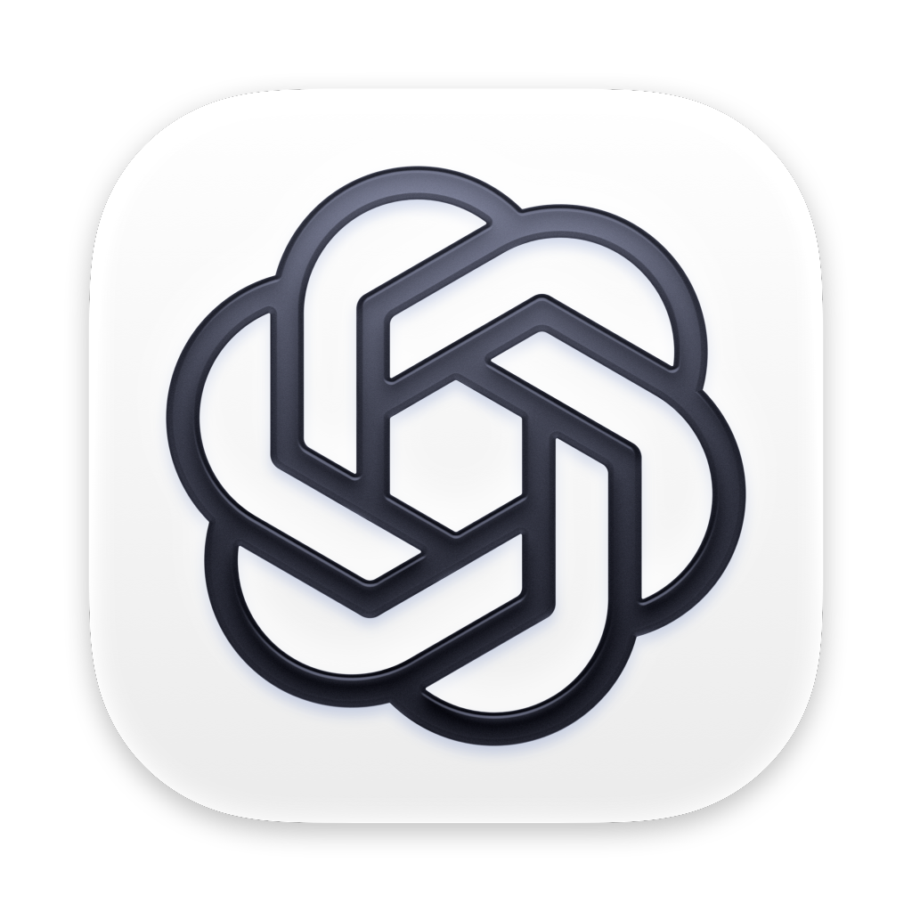

<p align="center">
  
</p>

<h1 align="center">ChatGPT</h1>

<p align="center">
  Официальное десктопное приложение ChatGPT со встроенным Codex
</p>

<p align="center">
  <a href="LICENSE"></a>
  
</p>

---

## Установка

```bash
sudo stplr install nivora/chatgpt
```

## Возможности

[ChatGPT for Desktop](https://developers.openai.com/codex/app) — официальное
приложение OpenAI: чат, голос, генерация изображений и встроенная панель
Codex (агент для работы с кодом, обработка ссылок `codex://`). Апстрим
объединил прежнее отдельное приложение Codex с ChatGPT — этот пакет
заменяет собой прежний `codex`, собиравшийся из неофициального
Linux-порта.

## Технические детали

Пакет извлекает официальный `.deb`-релиз OpenAI без изменений кода —
никаких сторонних патчей или пересборки Computer Use, как это было у
прежнего `codex`: панель Codex и Computer Use (`resources/cua_node`)
встроены в апстрим напрямую.

`auto_req=1`/`auto_prov=1` вместо ручных `deps_*`, как и у большинства
Electron-пакетов каталога, добавленных в этой сессии — зависимости
резолвятся по фактическому `DT_NEEDED` бинарника, а не по вручную
подобранным именам пакетов. `libnotify`/`libsecret`-эквивалент/`libXtst`/
`libXScrnSaver` остаются explicit — Chromium подключает их через `dlopen`,
чтобы не падать на системах без них, но Nivora нужна настоящая
функциональность, а не тихий fallback.

Приложение не содержит setuid-бинарника `chrome-sandbox` — вместо этого
собственный профиль AppArmor (`/etc/apparmor.d/chatgpt`) разрешает
непривилегированные user namespaces для песочницы Electron.

Собранные под musl варианты bundled нативных Node-аддонов
(`node-hid`, `serialport`) удаляются при сборке — они никогда не
загружаются на glibc-системе вроде ALT, но иначе ломают auto_req
неустановимой зависимостью на musl-соглашение об имени `libc.so`.

---

<p align="center">
  Часть <a href="../README.md"><b>Nivora</b></a>
</p>
